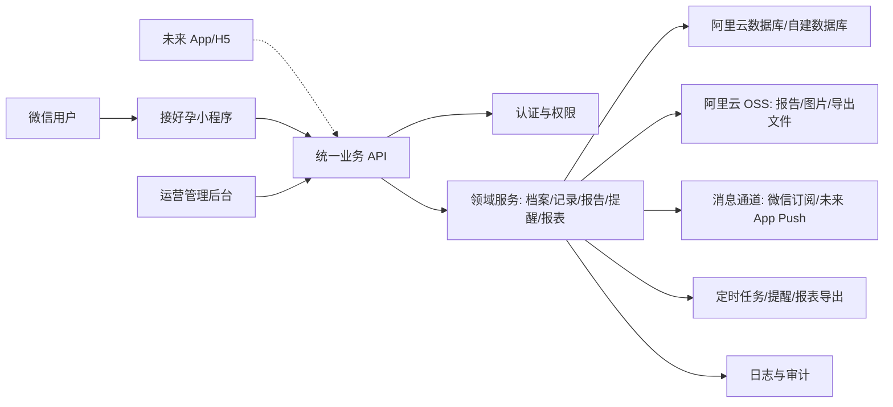
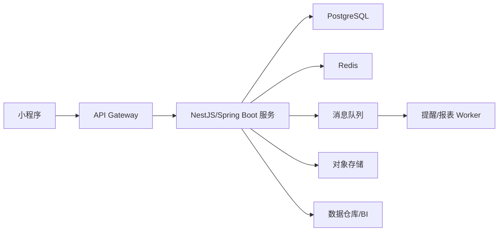
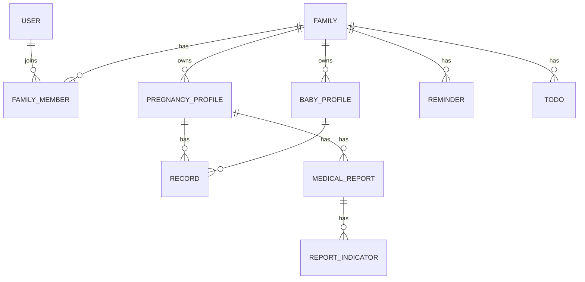
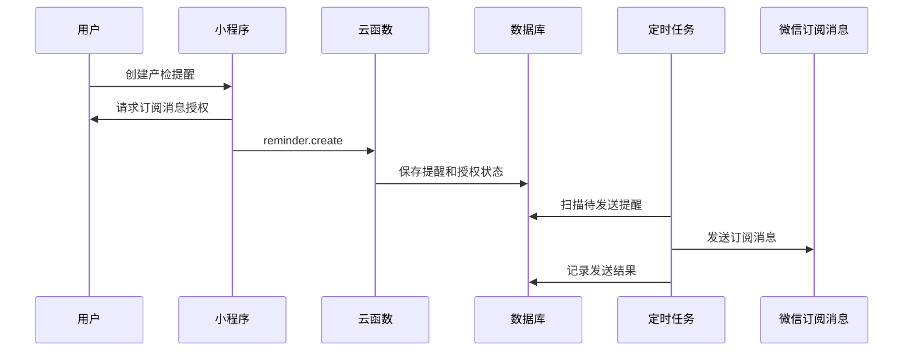
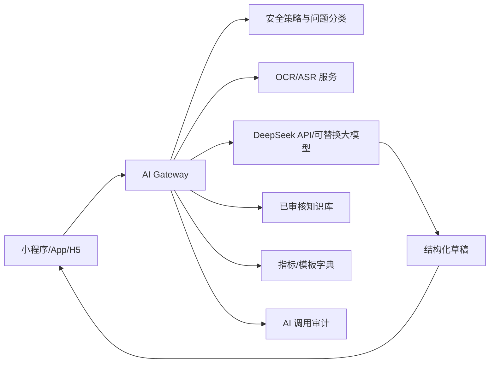

# 接好孕微信小程序产品设计与 IT 详细设计方案

版本：v0.1
日期：2026-05-25

## 1. 项目定位

“接好孕”定位为面向备孕、孕期、生产、产后和 0-6 岁宝宝照护家庭的全周期记录、提醒和知识辅助小程序。核心不是替代医生诊疗，而是帮助家庭把分散在医院报告、日历、备忘录、聊天记录、纸质手册里的信息结构化沉淀，形成可追踪、可提醒、可复盘、可共享的家庭孕育档案。

### 1.0 产品形态决策

首发形态确定为微信小程序，后续根据用户规模、留存、商业化和能力瓶颈扩展 App/H5。架构上必须按多端产品设计，不能把业务能力写死在小程序端。

决策原则：

1. 小程序负责高频轻交互：建档、记录、提醒、报告录入、家庭协同、报表查看。
2. 后端沉淀核心业务能力：用户、家庭、档案、记录、报告、提醒、模板、报表、权限、审计。
3. 内容和模板服务化：孕周内容、产检模板、疫苗模板、月子模板、指标字典由后端下发。
4. 文件和重资产外置：检查报告、B 超单、疫苗本、导出文件走云存储，不进入小程序包。
5. 复杂计算后端化：数据透视、趋势聚合、PDF/Excel 导出、提醒扫描、OCR 后处理由后端完成。
6. API 契约稳定：小程序、未来 App、H5、管理后台共用同一套业务 API。
7. 小程序工程不能直接操作跨端核心规则，核心规则应沉淀到服务端或共享业务包。

阶段策略：

| 阶段 | 交付形态 | 目标 |
| --- | --- | --- |
| P0 | 微信小程序 + 阿里云后端 API + 正式运营后台 | 按公开发布审核标准完成记录、提醒、报告、家庭共享、内容审核和运营配置闭环 |
| P1 | 强化小程序 + 正式管理后台 | 完成孕产育儿闭环、报表导出、权限审计 |
| P2 | 评估 App/H5 | 当推送、离线、性能、设备接入或会员服务成为明确瓶颈时扩展 |

### 1.1 核心用户

| 用户 | 核心诉求 | 产品侧重点 |
| --- | --- | --- |
| 备孕女性/夫妻 | 排卵、同房、基础体温、叶酸、孕前检查、生活方式管理 | 周期预测、备孕计划、检查清单、提醒 |
| 孕妈 | 孕周事项、产检、报告指标、用药、体重、胎动、待办 | 孕周首页、产检计划、报告 OCR/录入、风险提示 |
| 准爸爸/家人 | 陪诊、采购、准备待产包、理解孕妈状态 | 家庭共享、任务分工、提醒同步 |
| 产妇 | 产后恢复、恶露、伤口、哺乳、情绪、复查 | 产褥期计划、恢复记录、42 天复查提醒 |
| 宝宝照护人 | 喂养、睡眠、排便、疫苗、体检、成长曲线 | 快速记录、多宝宝档案、照护交接、报表 |

### 1.2 产品原则

1. 记录优先：所有阶段都能 3 秒内完成关键记录。
2. 阶段驱动：不同阶段展示不同的首页、提醒、清单和工具。
3. 家庭协同：一个孕育档案可被多人共同维护，但权限分层。
4. 医学边界清晰：提供科普、记录和就医提醒，不做诊断结论。
5. 数据可带走：支持导出 PDF/Excel，避免用户被锁定。
6. 隐私默认最小化：医疗健康、孕产、生育、儿童信息按敏感个人信息设计。

## 2. 竞品与借鉴

参考宝宝树孕育、妈妈网孕育、美柚、亲宝宝、BabyCenter、Ovia、What to Expect 等产品，可借鉴的成熟功能包括：

| 方向 | 常见优秀能力 | 接好孕建议 |
| --- | --- | --- |
| 阶段模式 | 经期、备孕、怀孕、育儿身份切换 | 做成“家庭档案阶段”，支持备孕、孕期、产后、宝宝多阶段并存 |
| 孕周内容 | 每日/每周宝宝发育、妈妈变化、注意事项 | 以孕周卡片为首页主线，叠加个人待办和检查 |
| 工具箱 | 排卵期、预产期、数胎动、计宫缩、能不能吃 | MVP 先做高频工具，后续扩展食物/药品/检查解释库 |
| 提醒管理 | 产检、喝水、营养、胎动、疫苗提醒 | 统一提醒中心，支持微信订阅消息授权和本地站内提醒 |
| 报告记录 | 产检记录、B 超、体重、血压 | 建立结构化指标库，支持图片附件和趋势图 |
| 育儿记录 | 喂养、睡眠、尿布、身高体重、疫苗 | 快速记录 + 日报/周报 + 多照护人同步 |
| 家庭共享 | 家人共同看宝宝照片和记录 | 基于家庭空间邀请，支持只读、可记录、管理员 |

差异化机会：

1. 不只做内容资讯，而是做“结构化孕育档案 + 计划引擎”。
2. 以检查报告、指标、用药、待办为中心，提升复诊和家庭沟通效率。
3. 适配中国小程序场景，轻量、无需安装、适合家人协作。
4. 建立“阶段模板库”：孕周模板、产检模板、月子模板、宝宝照护模板可持续更新。

## 3. 功能范围

### 3.1 阶段总览

| 阶段 | 时间范围 | 核心模块 |
| --- | --- | --- |
| 备孕 | 开始备孕至确认怀孕 | 周期/排卵、同房记录、基础体温、试纸、孕前检查、营养补充、习惯管理 |
| 孕早期 | 0-13+6 周 | 建档、早孕检查、孕吐/症状、叶酸/药物、风险因素、首次产检 |
| 孕中期 | 14-27+6 周 | 唐筛/无创/羊穿、系统 B 超、糖耐准备、体重血压、胎动准备 |
| 孕晚期 | 28 周至生产 | 胎动、产检高频提醒、入院证件、待产包、分娩计划、宫缩记录 |
| 生产 | 临产至出院 | 宫缩、破水/见红、入院、产程、分娩方式、宝宝出生信息、费用 |
| 产后/月子 | 出院至产后 42 天/100 天 | 恶露、伤口、哺乳、情绪、睡眠、营养、复查、家务分工 |
| 育儿 | 出生至 6 岁 | 喂养、睡眠、尿布、疫苗、体检、成长曲线、疾病用药、里程碑 |

### 3.2 MVP 范围

建议第一版聚焦“记录 + 提醒 + 报表 + 家庭共享”，避免一开始做重社区和电商。

必须做：

1. 微信登录、家庭空间、成员邀请。
2. 女性档案、孕育档案、宝宝档案。
3. 阶段首页：备孕/孕期/产后/宝宝。
4. 备孕记录：月经、排卵试纸、同房、基础体温、叶酸/补剂、孕前检查。
5. 孕期记录：孕周时间轴、产检、报告指标、体重、血压、症状、用药、胎动、待办。
6. 生产记录：临产事件、宫缩计时、分娩信息、宝宝出生信息。
7. 产后记录：恶露、伤口/疼痛、哺乳、情绪、产后复查。
8. 宝宝记录：喂养、睡眠、尿布、身高体重头围、疫苗、体检、用药。
9. 提醒中心：产检、用药/补剂、胎动、复查、疫苗、体检、自定义提醒。
10. 数据看板：备孕周期、孕期体重/血压、产检完成率、宝宝喂养/睡眠/成长曲线。
11. 文件附件：检查报告、B 超单、出院记录、疫苗本照片。
12. 隐私授权、数据导出、注销/删除数据。

暂缓：

1. 社区、直播、商城。
2. 医生问诊闭环。
3. AI 诊断或报告自动结论。
4. 大规模内容 CMS 和复杂推荐。

## 4. 信息架构与前端页面

### 4.1 小程序 Tab 结构

底部 4 个 Tab：

1. 首页：当前阶段的今日状态、提醒、快捷记录、关键指标。
2. 记录：按阶段分类的全部记录入口和时间线。
3. 报表：趋势图、完成率、数据透视、导出。
4. 我的：家庭空间、档案、成员、设置、隐私、数据导出。

### 4.2 首页布局

#### 备孕首页

顶部：

- 当前周期第 N 天，预测排卵日/易孕期。
- 今日建议：叶酸、试纸、同房建议、生活方式提醒。

中部快捷记录：

- 月经开始/结束。
- 排卵试纸：阴性/弱阳/阳性/强阳。
- 同房记录。
- 基础体温。
- 症状/心情。
- 服用叶酸/补剂。

底部：

- 待办：孕前检查、疫苗、口腔检查、慢病复查。
- 趋势：体温曲线、周期长度、同房分布。

#### 孕期首页

顶部：

- 孕周：如 18 周 + 3 天。
- 距预产期天数。
- 本周宝宝发育、孕妈变化、注意事项摘要。

中部快捷记录：

- 体重、血压、胎动、症状、用药、饮水/营养、心情。

重点卡片：

- 本周待做：产检、检查项目、资料准备。
- 最近报告：异常标记、待复查项。
- 风险提示：基于用户输入做“建议咨询医生”的提醒，不输出诊断。

#### 产后首页

顶部：

- 产后第 N 天、宝宝日龄。
- 今日恢复计划：休息、伤口、恶露、哺乳、情绪。

快捷记录：

- 恶露、疼痛、体温、伤口、哺乳/吸奶、睡眠、情绪。

待办：

- 产后访视、42 天复查、盆底评估、宝宝体检。

#### 宝宝首页

顶部：

- 宝宝日龄/月龄、多宝宝切换。
- 今日摘要：上次喂奶、上次换尿布、睡眠总量、下次疫苗。

快捷记录：

- 母乳亲喂、瓶喂、配方奶、辅食、睡眠、尿布、体温、用药、身高体重。

看板：

- 今日喂养次数/奶量、睡眠分布、尿布次数、成长百分位。

### 4.3 关键页面清单

| 页面 | 路径建议 | 主要能力 |
| --- | --- | --- |
| 阶段选择/建档 | `/pages/onboarding/index` | 选择备孕/已孕/已生产，录入末次月经、预产期、宝宝生日 |
| 首页 | `/pages/home/index` | 阶段化首页 |
| 记录中心 | `/pages/records/index` | 分类入口、最近记录、搜索 |
| 时间线 | `/pages/timeline/index` | 按日期/孕周/月龄查看所有事项 |
| 产检计划 | `/pages/prenatal-plan/index` | 自动生成计划、完成状态、报告关联 |
| 检查报告 | `/pages/reports/index` | 报告列表、指标录入、附件 |
| 报告详情 | `/pages/reports/detail` | 指标、参考范围、图片、复查提醒 |
| 用药/补剂 | `/pages/medications/index` | 药品、剂量、频次、医生来源、提醒 |
| 待办清单 | `/pages/todos/index` | 分类、截止日、负责人、提醒 |
| 提醒中心 | `/pages/reminders/index` | 订阅授权、提醒规则、发送记录 |
| 工具箱 | `/pages/tools/index` | 预产期、胎动、宫缩、疫苗、成长曲线 |
| 宝宝记录 | `/pages/baby/records` | 喂养、睡眠、尿布、成长 |
| 报表中心 | `/pages/analytics/index` | 趋势图、透视、导出 |
| 家庭空间 | `/pages/family/index` | 成员邀请、权限、档案切换 |
| 隐私与数据 | `/pages/privacy/index` | 授权、导出、删除、注销 |

### 4.4 交互细节

快捷记录：

- 首页常驻 4-6 个最高频动作。
- 记录弹层优先使用单手可操作的底部 Sheet。
- 默认值取上一次记录，减少输入。
- 支持“补记”：选择日期、孕周、宝宝月龄。

时间线：

- 时间轴按“自然日 + 阶段标签”展示。
- 支持筛选：产检、报告、用药、症状、宝宝喂养、宝宝睡眠。
- 每条记录显示来源：本人、伴侣、导入、系统生成。

报告录入：

- MVP 允许手动录入指标 + 上传图片。
- 指标字段采用结构化模板，如血常规、尿常规、肝肾功能、糖耐、B 超。
- 参考范围必须支持“医院/孕周/单位差异”，默认只做趋势，不武断判定。

提醒授权：

- 微信订阅消息是一次性/长期订阅能力受模板和用户授权限制影响，产品要在关键场景触发授权，例如“保存产检提醒”后请求订阅。
- 站内提醒永远可见，微信消息作为增强通道。

家庭协同：

- 邀请方式：微信分享卡片。
- 权限：管理员、可编辑、只读。
- 敏感记录可设置“仅本人可见”，如情绪、同房、部分报告。

### 4.5 多语言界面设计约束

首版需要兼容简体中文、繁体中文、英文。前端不能先按中文固定布局再后补翻译，必须从组件和页面设计阶段考虑不同语言长度。

设计要求：

1. 所有文案使用 i18n key，不允许在组件内硬编码中文。
2. 按英文最长文案预留按钮、Tab、表单标签、卡片标题空间。
3. 按钮优先使用图标 + 短文本，长命令放到菜单或详情页。
4. 首页卡片、快捷记录、报表图例必须支持自动换行和多行截断。
5. 列表项使用“主标题 + 次级说明 + 状态标签”布局，避免依赖固定列宽。
6. 日期、数字、单位、孕周/月龄格式使用 locale formatter。
7. 繁体中文不只做字形转换，涉及地区差异的医学术语和表达需单独维护。
8. 英文界面避免中式直译，医学内容需要英文审核来源或人工校对。

前端组件建议：

| 组件 | 多语言设计 |
| --- | --- |
| TabBar | 图标为主，文本短标签，英文不超过 12 个字符优先 |
| 快捷记录按钮 | 固定图标区，文本最多两行 |
| 表单 | 标签在上、输入在下，避免左右布局被英文撑爆 |
| 数据卡片 | 数字和单位分离，单位可换行或缩小 |
| 图表 | legend 支持滚动/换行，tooltip 按 locale 格式化 |
| 空状态 | 短标题 + 可选说明，避免大段说明占屏 |

## 5. 内容与模板设计

### 5.1 孕周模板

每个孕周一条模板：

```json
{
  "week": 18,
  "babySummary": "胎儿快速发育，听觉逐步建立",
  "motherSummary": "可能出现腰背酸、食欲变化",
  "todoTemplates": [
    {"title": "关注体重增长", "category": "health"},
    {"title": "准备下次产检资料", "category": "prenatal_check"}
  ],
  "recordPrompts": ["体重", "血压", "症状", "用药"]
}
```

### 5.2 产检模板

产检模板不应代替当地医院医嘱，建议作为“默认计划 + 可编辑”。

| 模板字段 | 示例 |
| --- | --- |
| 检查名称 | 第一次产检/建档 |
| 推荐孕周 | 6-13 周 |
| 常见项目 | 血常规、尿常规、血型、肝肾功能、传染病筛查、B 超 |
| 准备事项 | 空腹、证件、既往病史、用药清单 |
| 报告模板 | 关联血常规、尿常规、B 超指标 |
| 提醒规则 | 提前 7 天、前 1 天、当天 |

### 5.3 产后/月子模板

按产后日龄生成：

- D1-D7：出血、伤口、体温、乳房、排尿排便、情绪、宝宝黄疸观察。
- D8-D28：恶露变化、睡眠、营养、哺乳、伤口恢复。
- D29-D42：复查准备、盆底、避孕、运动恢复、心理状态。

### 5.4 宝宝照护模板

按宝宝月龄：

- 新生儿：喂养、尿布、黄疸、脐带、体重回升、睡眠安全。
- 1-6 月：疫苗、体检、喂养、睡眠、抬头翻身等里程碑。
- 6-12 月：辅食、出牙、坐爬站、过敏记录。
- 1-3 岁：语言、运动、饮食、睡眠、如厕。
- 3-6 岁：身高体重、视力、口腔、入园准备。

## 6. 数据报表与数据透视

### 6.1 报表类型

| 报表 | 维度 | 指标 |
| --- | --- | --- |
| 备孕周期分析 | 周期、月份 | 周期长度、排卵日、同房分布、体温高低温相 |
| 孕期体重 | 孕周 | 体重、周增长、累计增长 |
| 孕期血压 | 日期、孕周 | 收缩压、舒张压、异常次数 |
| 产检进度 | 孕周、检查类型 | 完成率、待复查、逾期项 |
| 用药/补剂 | 日期、药品 | 服用次数、漏服次数、持续天数 |
| 胎动 | 日期、时段 | 次数、时长、趋势 |
| 宫缩 | 时间 | 间隔、持续时长、频率 |
| 产后恢复 | 产后日龄 | 恶露、疼痛、体温、情绪评分 |
| 宝宝喂养 | 日期、照护人 | 次数、奶量、亲喂时长、辅食种类 |
| 宝宝睡眠 | 日期、白天/夜间 | 总时长、最长连续睡眠、醒来次数 |
| 宝宝成长 | 月龄、性别 | 身高、体重、头围、百分位 |
| 疫苗/体检 | 月龄、项目 | 完成率、逾期项、下次时间 |

### 6.2 数据透视

透视能力建议第二期做，但数据模型第一期要留好：

- 按阶段、人员、日期、类型聚合。
- 支持导出 CSV/XLSX。
- 支持“产检报告 + 指标趋势”的组合视图。
- 支持宝宝日报、孕期周报、产后恢复周报。

### 6.3 图表组件

小程序端建议使用 ECharts for Weixin 或 F2：

- 折线图：体重、血压、体温、宝宝成长。
- 柱状图：喂养次数、尿布次数、睡眠时长。
- 日历热力图：用药、同房、胎动、症状。
- 百分位曲线：宝宝身高、体重、头围。

## 7. 系统架构

### 7.1 推荐架构

首发推荐“微信小程序 + 阿里云多端业务后端”的架构。你目前已有一台阿里云服务器，因此第一版没有必要为了上线微信小程序额外购买腾讯云服务；只要后端域名完成备案、配置 HTTPS，并在微信小程序后台配置合法请求域名，小程序可以直接调用阿里云后端。

推荐技术路线：

1. 前端首发：微信原生小程序，优先保证微信体验、订阅消息、分享邀请和审核稳定性。
2. 后端首发：阿里云 ECS/容器 + 关系型数据库 + OSS + 定时任务，按多端 API 服务设计。
3. 业务核心：沉淀为独立 service/domain 层，推荐 NestJS 或 Spring Boot；未来 App/H5/管理后台复用同一套 API。
4. API 契约：从第一天开始维护 JSON Schema/OpenAPI，未来 App/H5 直接复用。
5. 内容模板：后端下发，客户端按阶段缓存，不把大内容写死在小程序包。
6. 腾讯云能力：仅在确实需要 CloudBase、微信生态一体化能力或成本/运维优势明显时再引入。

是否需要额外购买腾讯云：

| 场景 | 建议 |
| --- | --- |
| 只上线微信小程序，已有阿里云服务器和备案域名 | 不必额外购买腾讯云 |
| 需要最快接入微信云开发、云函数和云数据库 | 可考虑 CloudBase，但会增加一套云资源 |
| 未来同时做 App/H5，强调统一后端 | 优先阿里云自建 API，避免云开发绑定 |
| 只需要微信登录、订阅消息 | 不需要腾讯云，小程序后端可在阿里云调用微信开放接口 |
| 需要文件存储、导出、报告图片 | 使用阿里云 OSS 即可 |

阿里云上线微信小程序需要满足：

1. 后端 API 使用 HTTPS。
2. 域名完成 ICP 备案。
3. 在微信小程序后台配置 request/upload/download 合法域名。
4. 后端实现微信登录 code 换 openid/session 的服务端流程。
5. 订阅消息发送由后端调用微信接口完成。



### 7.2 模块划分

小程序前端：

- `app`：登录、全局状态、阶段路由。
- `pages/home`：阶段首页。
- `pages/records`：记录中心。
- `pages/reports`：报告与指标。
- `pages/reminders`：提醒中心。
- `pages/analytics`：报表。
- `pages/family`：家庭空间。
- `components/quick-record`：快捷记录组件。
- `components/week-card`：孕周卡片。
- `components/chart-card`：图表卡片。

前端边界：

- 可以做页面状态、表单校验、轻量缓存、图表渲染。
- 不负责最终权限判断、孕周计划生成、提醒扫描、指标解释规则。
- 不直接拼接跨端核心数据结构，所有写入走统一 API。

后端服务：

- `auth`：登录态、用户初始化。
- `family`：家庭空间与成员权限。
- `profile`：女性档案、孕育档案、宝宝档案。
- `record`：统一记录 CRUD。
- `report`：报告、指标、附件。
- `plan`：阶段计划生成、待办生成。
- `reminder`：提醒创建、授权、发送、完成。
- `analytics`：报表聚合。
- `export`：PDF/Excel 导出。
- `admin`：模板管理、内容发布。

数据层：

- 用户与权限集合。
- 档案集合。
- 记录集合。
- 模板集合。
- 提醒集合。
- 报表聚合集合。
- 审计日志集合。

未来 App 复用点：

- 复用后端 API、权限、提醒、报表、模板、数据模型。
- App 只新增客户端能力：更强本地通知、离线记录、后台同步、设备接入。
- 不重新设计一套业务数据库。

### 7.3 演进架构

当出现以下情况，考虑拆自建后端：

- 需要复杂 SQL 分析和数据仓库。
- 需要接入医院/设备/第三方 OCR 服务。
- 需要更强的审计、加密、风控和权限系统。
- DAU 增长导致云函数冷启动或成本不可控。

演进目标：



## 8. 后端数据模型

### 8.1 设计原则

1. 用 `familyId` 作为协同边界。
2. 用 `subjectType + subjectId` 支持同一记录系统覆盖妈妈、孕育档案、宝宝。
3. 高频记录统一进入 `records` 集合，减少表爆炸。
4. 检查报告和指标独立建模，便于趋势分析。
5. 所有敏感数据保留 `privacyLevel` 和审计字段。

### 8.2 核心实体关系



### 8.3 集合设计

#### users

```json
{
  "_id": "u_xxx",
  "openid": "wechat_openid",
  "unionid": "optional",
  "nickname": "Tao",
  "avatarUrl": "",
  "phone": "",
  "defaultFamilyId": "fam_xxx",
  "privacyConsentVersion": "2026-05-25",
  "createdAt": "2026-05-25T00:00:00+08:00",
  "updatedAt": "2026-05-25T00:00:00+08:00",
  "deletedAt": null
}
```

#### families

```json
{
  "_id": "fam_xxx",
  "name": "我们的家",
  "ownerUserId": "u_xxx",
  "createdAt": "2026-05-25T00:00:00+08:00"
}
```

#### family_members

```json
{
  "_id": "fm_xxx",
  "familyId": "fam_xxx",
  "userId": "u_xxx",
  "role": "admin",
  "permissions": ["record:read", "record:write", "report:read", "member:manage"],
  "relation": "mother",
  "status": "active",
  "joinedAt": "2026-05-25T00:00:00+08:00"
}
```

#### mother_profiles

```json
{
  "_id": "mp_xxx",
  "familyId": "fam_xxx",
  "ownerUserId": "u_xxx",
  "birthday": "1995-01-01",
  "heightCm": 165,
  "prePregnancyWeightKg": 55,
  "bloodType": "A",
  "allergies": ["青霉素"],
  "chronicDiseases": [],
  "obstetricHistory": {
    "gravidity": 1,
    "parity": 0,
    "miscarriageCount": 0
  }
}
```

#### pregnancy_profiles

```json
{
  "_id": "preg_xxx",
  "familyId": "fam_xxx",
  "motherProfileId": "mp_xxx",
  "status": "pregnant",
  "lmpDate": "2026-01-01",
  "dueDate": "2026-10-08",
  "conceptionMethod": "natural",
  "fetusCount": 1,
  "riskLevel": "unknown",
  "hospitalName": "",
  "createdAt": "2026-05-25T00:00:00+08:00"
}
```

#### baby_profiles

```json
{
  "_id": "baby_xxx",
  "familyId": "fam_xxx",
  "pregnancyId": "preg_xxx",
  "name": "宝宝",
  "gender": "unknown",
  "birthDateTime": "2026-10-01T08:30:00+08:00",
  "gestationalWeeksAtBirth": 39,
  "birthWeightKg": 3.2,
  "birthLengthCm": 50,
  "birthHeadCircumferenceCm": 34,
  "deliveryMode": "vaginal"
}
```

#### records

统一记录集合：

```json
{
  "_id": "rec_xxx",
  "familyId": "fam_xxx",
  "subjectType": "pregnancy",
  "subjectId": "preg_xxx",
  "recordType": "blood_pressure",
  "occurredAt": "2026-05-25T08:00:00+08:00",
  "stage": "pregnancy",
  "gestationalDay": 144,
  "babyAgeDay": null,
  "payload": {
    "systolic": 110,
    "diastolic": 70,
    "heartRate": 78
  },
  "attachments": [],
  "note": "",
  "privacyLevel": "family",
  "createdBy": "u_xxx",
  "createdAt": "2026-05-25T08:01:00+08:00",
  "updatedAt": "2026-05-25T08:01:00+08:00"
}
```

常见 `recordType`：

- 备孕：`menstruation`、`ovulation_test`、`intercourse`、`basal_temperature`、`pregnancy_test`、`supplement_intake`。
- 孕期：`weight`、`blood_pressure`、`symptom`、`medication_intake`、`fetal_movement`、`prenatal_visit`、`mood`。
- 生产：`contraction`、`water_breaking`、`bloody_show`、`hospital_admission`、`delivery_event`。
- 产后：`lochia`、`wound`、`postpartum_pain`、`breastfeeding`、`postpartum_mood`。
- 宝宝：`feeding`、`sleep`、`diaper`、`growth_measurement`、`vaccine`、`baby_medication`、`milestone`。

#### medical_reports

```json
{
  "_id": "report_xxx",
  "familyId": "fam_xxx",
  "subjectType": "pregnancy",
  "subjectId": "preg_xxx",
  "reportType": "blood_routine",
  "title": "孕 24 周血常规",
  "hospitalName": "某医院",
  "examinedAt": "2026-05-25",
  "gestationalDay": 168,
  "attachments": [
    {"fileId": "cloud://xxx", "name": "report.jpg", "type": "image"}
  ],
  "summary": "",
  "status": "draft",
  "createdBy": "u_xxx",
  "createdAt": "2026-05-25T00:00:00+08:00"
}
```

#### report_indicators

```json
{
  "_id": "ind_xxx",
  "reportId": "report_xxx",
  "familyId": "fam_xxx",
  "code": "HGB",
  "name": "血红蛋白",
  "value": 118,
  "unit": "g/L",
  "referenceMin": 110,
  "referenceMax": 150,
  "flag": "normal",
  "source": "manual"
}
```

#### todos

```json
{
  "_id": "todo_xxx",
  "familyId": "fam_xxx",
  "subjectType": "pregnancy",
  "subjectId": "preg_xxx",
  "title": "预约糖耐检查",
  "category": "prenatal_check",
  "dueAt": "2026-06-01T09:00:00+08:00",
  "assigneeUserId": "u_xxx",
  "status": "pending",
  "source": "template",
  "relatedReportId": null,
  "createdAt": "2026-05-25T00:00:00+08:00"
}
```

#### reminders

```json
{
  "_id": "rem_xxx",
  "familyId": "fam_xxx",
  "targetUserIds": ["u_xxx"],
  "subjectType": "pregnancy",
  "subjectId": "preg_xxx",
  "title": "明天产检",
  "scene": "prenatal_check",
  "triggerAt": "2026-06-01T08:00:00+08:00",
  "repeatRule": null,
  "channels": ["in_app", "wechat_subscribe"],
  "wechatTemplateId": "xxx",
  "status": "scheduled",
  "relatedTodoId": "todo_xxx",
  "createdAt": "2026-05-25T00:00:00+08:00"
}
```

#### templates

```json
{
  "_id": "tpl_xxx",
  "type": "pregnancy_week",
  "version": "2026.05",
  "locale": "zh-CN",
  "applicableStage": "pregnancy",
  "payload": {},
  "enabled": true
}
```

#### audit_logs

```json
{
  "_id": "audit_xxx",
  "familyId": "fam_xxx",
  "userId": "u_xxx",
  "action": "report.read",
  "resourceType": "medical_report",
  "resourceId": "report_xxx",
  "ip": "",
  "createdAt": "2026-05-25T00:00:00+08:00"
}
```

## 9. 后端接口设计

### 9.1 API 风格

云函数可以对外暴露统一入口：

```http
POST /api
{
  "action": "record.create",
  "data": {}
}
```

也可以按云函数拆分：

- `auth.login`
- `family.create`
- `record.create`
- `record.list`
- `analytics.summary`

MVP 建议按业务云函数拆分，函数内部再用 action 分发，兼顾清晰和部署便利。

### 9.2 通用响应

```json
{
  "requestId": "req_xxx",
  "success": true,
  "data": {},
  "error": null
}
```

错误：

```json
{
  "requestId": "req_xxx",
  "success": false,
  "data": null,
  "error": {
    "code": "PERMISSION_DENIED",
    "message": "无权访问该家庭档案"
  }
}
```

### 9.3 主要接口

#### 登录与初始化

`auth.login`

请求：

```json
{
  "code": "wx_login_code",
  "profile": {
    "nickname": "Tao",
    "avatarUrl": ""
  }
}
```

响应：

```json
{
  "token": "session_token",
  "user": {},
  "defaultFamily": {},
  "needOnboarding": true
}
```

#### 创建孕育档案

`profile.createPregnancy`

请求：

```json
{
  "familyId": "fam_xxx",
  "motherProfile": {
    "heightCm": 165,
    "prePregnancyWeightKg": 55
  },
  "pregnancy": {
    "lmpDate": "2026-01-01",
    "dueDate": "2026-10-08",
    "fetusCount": 1
  }
}
```

响应：

```json
{
  "motherProfileId": "mp_xxx",
  "pregnancyId": "preg_xxx",
  "generatedTodos": 12,
  "generatedReminders": 5
}
```

#### 创建记录

`record.create`

请求：

```json
{
  "familyId": "fam_xxx",
  "subjectType": "pregnancy",
  "subjectId": "preg_xxx",
  "recordType": "weight",
  "occurredAt": "2026-05-25T08:00:00+08:00",
  "payload": {
    "weightKg": 60.5
  },
  "note": ""
}
```

响应：

```json
{
  "recordId": "rec_xxx"
}
```

#### 查询记录

`record.list`

请求：

```json
{
  "familyId": "fam_xxx",
  "subjectType": "pregnancy",
  "subjectId": "preg_xxx",
  "recordTypes": ["weight", "blood_pressure"],
  "startAt": "2026-05-01T00:00:00+08:00",
  "endAt": "2026-05-31T23:59:59+08:00",
  "pageSize": 20,
  "cursor": null
}
```

#### 创建报告

`report.create`

请求：

```json
{
  "familyId": "fam_xxx",
  "subjectType": "pregnancy",
  "subjectId": "preg_xxx",
  "reportType": "blood_routine",
  "title": "血常规",
  "examinedAt": "2026-05-25",
  "indicators": [
    {"code": "HGB", "name": "血红蛋白", "value": 118, "unit": "g/L"}
  ],
  "attachments": []
}
```

#### 获取首页摘要

`home.getSummary`

请求：

```json
{
  "familyId": "fam_xxx",
  "activeSubjectType": "pregnancy",
  "activeSubjectId": "preg_xxx",
  "date": "2026-05-25"
}
```

响应：

```json
{
  "stage": "pregnancy",
  "gestationalWeek": "20+4",
  "cards": [],
  "quickActions": [],
  "todayTodos": [],
  "todayReminders": [],
  "recentRecords": []
}
```

#### 创建提醒

`reminder.create`

请求：

```json
{
  "familyId": "fam_xxx",
  "targetUserIds": ["u_xxx"],
  "title": "服用叶酸",
  "scene": "medication",
  "triggerAt": "2026-05-25T21:00:00+08:00",
  "repeatRule": "FREQ=DAILY;INTERVAL=1",
  "channels": ["in_app", "wechat_subscribe"]
}
```

#### 报表聚合

`analytics.getMetricSeries`

请求：

```json
{
  "familyId": "fam_xxx",
  "subjectType": "pregnancy",
  "subjectId": "preg_xxx",
  "metric": "weight",
  "groupBy": "gestational_week",
  "startAt": "2026-01-01",
  "endAt": "2026-10-01"
}
```

#### 导出数据

`export.create`

请求：

```json
{
  "familyId": "fam_xxx",
  "subjectType": "pregnancy",
  "subjectId": "preg_xxx",
  "format": "xlsx",
  "range": {
    "startAt": "2026-01-01",
    "endAt": "2026-10-01"
  },
  "sections": ["records", "reports", "todos"]
}
```

响应：

```json
{
  "exportId": "exp_xxx",
  "status": "processing"
}
```

## 10. 权限、安全与合规

### 10.1 敏感信息范围

本产品会处理：

- 医疗健康信息：检查报告、指标、用药、症状、体重血压等。
- 生育相关信息：备孕、同房、怀孕、生产记录。
- 未成年人信息：宝宝姓名、生日、成长、疫苗、健康记录。

这些应按敏感个人信息设计，需要单独同意、明确用途、最小必要、严格保护、可撤回、可删除。

### 10.2 权限控制

权限模型：

- 用户登录后只能访问自己加入的 `familyId`。
- 每次读写校验 `family_members`。
- 敏感记录可设 `privacyLevel`：
  - `private`：仅创建者。
  - `family`：家庭成员按权限可见。
  - `admin_only`：管理员可见。

### 10.3 数据保护

MVP 必须具备：

1. HTTPS/云调用安全通道。
2. 服务端权限校验，不能只依赖小程序端。
3. 云数据库安全规则限制跨家庭访问。
4. 云存储文件按 `familyId` 和资源权限签发临时访问。
5. 敏感操作审计：查看报告、导出、删除、邀请成员。
6. 数据删除：注销账号、退出家庭、删除宝宝/孕育档案。
7. 备份与恢复策略。

建议增强：

1. 关键字段应用层加密，如报告备注、同房记录、情绪记录。
2. 导出文件短期有效，过期自动删除。
3. 风险关键词提示就医时，不保存不必要的原始推理内容。

### 10.4 医疗合规边界

产品文案必须避免：

- “诊断为……”
- “你一定患有……”
- “按本产品建议用药……”

推荐表达：

- “该指标可能受孕周、医院参考范围和个人情况影响，请以医生解释为准。”
- “如出现明显不适、出血、腹痛、胎动异常等，请及时就医。”
- “本工具用于记录和提醒，不替代医生诊疗。”

### 10.5 医学内容审核建议

当前初衷是自用，老婆已孕 6 周，需要完整记录孕期、生产、产后事项；如果后续对外发布运营，医学内容需要分阶段建立审核机制。

#### 自用/MVP 阶段

可以先不做正式医学专家背书，但必须做到：

1. 内容只来自权威公开资料，如国家卫健委、WHO、CDC、ACOG、医院公开科普等。
2. 每条知识、检查模板、提醒模板保留来源、版本、更新时间。
3. 不输出诊断、治疗、用药决策，只提供记录、提醒、科普和就医建议。
4. 对高风险症状设置固定兜底文案，例如阴道出血、持续腹痛、剧烈头痛、视物模糊、胎动明显异常、发热等，提示及时就医。
5. 涉及药品、检查异常、报告解读时提示“以医生解释为准”。

#### 对外发布阶段

建议至少找 1 名妇产科医生或助产士、1 名儿保/儿科医生作为兼职医学顾问，建立轻量审核流程：

| 内容类型 | 审核要求 |
| --- | --- |
| 孕周科普、月子指南、宝宝照护 | 医学顾问抽审或全量审核 |
| 产检、疫苗、复查提醒模板 | 医学顾问全量审核 |
| 报告指标解释、用药相关内容 | 医学顾问全量审核，且只做解释不做决策 |
| AI 问答知识库 | 入库前审核，答案必须引用已审核内容 |
| 用户生成记录 | 不需要审核，但敏感内容要保护隐私 |

内容治理字段建议：

```json
{
  "contentId": "cnt_xxx",
  "title": "孕 6 周注意事项",
  "category": "pregnancy_week",
  "sourceType": "official_guideline",
  "sourceUrl": "https://...",
  "medicalReviewer": "doctor_xxx",
  "reviewStatus": "approved",
  "reviewedAt": "2026-05-25",
  "version": "2026.05.1",
  "riskLevel": "low"
}
```

#### 不建议初期触碰的边界

1. 不做线上问诊。
2. 不让 AI 给出“是否正常/是否患病”的结论。
3. 不让 AI 推荐处方药、停药、改剂量。
4. 不宣传“AI 诊断”“AI 医生”“替代产检”。
5. 不把报告识别结果作为医疗结论，只作为用户记录和复诊材料整理。

## 11. 提醒系统设计

### 11.1 提醒类型

| 类型 | 来源 | 示例 |
| --- | --- | --- |
| 系统计划 | 模板生成 | 产检、孕周待办、疫苗、体检 |
| 用户自定义 | 用户创建 | 喝水、补剂、复查、采购 |
| 记录触发 | 记录行为 | 保存报告后提醒复查 |
| 周期触发 | 规则引擎 | 每天叶酸、每晚胎动 |

### 11.2 流程



### 11.3 发送策略

- 提前提醒：T-7 天、T-1 天、当天。
- 失败重试：最多 3 次，指数退避。
- 去重：同一用户同一事项同一通道 24 小时内不重复发送。
- 兜底：微信订阅未授权时，首页和提醒中心展示红点。

## 12. AI 能力设计

### 12.1 AI 定位

AI 能力定位为“智能整理助手”，不定位为“AI 医生”。核心目标是降低记录成本，把文字、语音、图片输入自动整理到对应模块，形成结构化孕育档案。

首期建议做：

1. 检查报告 OCR 识别：识别报告名称、医院、检查日期、指标、单位、参考范围。
2. 图片归档：B 超单、化验单、出院记录、疫苗本照片自动分类。
3. 语音转记录：用户说“今天孕 6 周，早上有点恶心，吃了叶酸”，自动生成症状和补剂记录。
4. 文本智能拆分：一段文字自动拆成待办、用药、检查、症状、宝宝记录。
5. AI 问答：仅基于已审核知识库和用户记录做科普、整理、检索，不做诊断。

暂缓：

1. 自动判断报告是否异常。
2. 自动给治疗建议。
3. 自动推荐药品。
4. 高风险症状的自由问答结论。

### 12.2 多模态输入流程


关键原则：

- AI 只能生成草稿，必须经过用户确认后入库。
- 每条 AI 生成记录保留 `source=ai_draft`、原始输入、识别置信度、用户确认时间。
- 低置信度字段必须高亮让用户确认。
- 对医疗指标不做结论性诊断，只标记“已识别/待确认/需医生解释”。

### 12.3 AI 报告识别

报告识别流程：

1. 用户上传图片/PDF。
2. 服务端上传至国内云存储。
3. OCR 提取文本。
4. LLM/规则引擎识别报告类型、检查日期、医院、孕周、指标。
5. 根据指标字典标准化名称、单位、数值。
6. 生成报告草稿。
7. 用户确认后写入 `medical_reports` 和 `report_indicators`。

识别结果示例：

```json
{
  "reportType": "blood_routine",
  "title": "血常规",
  "examinedAt": "2026-05-25",
  "hospitalName": "某医院",
  "indicators": [
    {
      "code": "HGB",
      "name": "血红蛋白",
      "value": 118,
      "unit": "g/L",
      "referenceMin": 110,
      "referenceMax": 150,
      "confidence": 0.92,
      "needsReview": false
    }
  ],
  "warnings": [
    "参考范围可能因医院和孕周不同而变化，请以医生解释为准。"
  ]
}
```

### 12.4 语音与文字自动归档

用户输入示例：

> 今天孕 6 周 2 天，早上恶心，吃了叶酸，预约了下周三去做 B 超。

AI 应拆成：

```json
{
  "records": [
    {
      "recordType": "symptom",
      "payload": {"name": "恶心", "severity": "unknown", "timeOfDay": "morning"}
    },
    {
      "recordType": "supplement_intake",
      "payload": {"name": "叶酸"}
    }
  ],
  "todos": [
    {
      "title": "做 B 超",
      "category": "prenatal_check",
      "dueAt": "下周三",
      "needsDateConfirmation": true
    }
  ]
}
```

交互要求：

- 展示为“待确认卡片”，用户可逐条勾选、修改、删除。
- 对相对日期如“下周三”必须转换成具体日期并让用户确认。
- 对“医生说”“报告显示”等语句保留来源备注。

### 12.5 AI 问答建议

AI 问答可以做，但边界要严格。

适合回答：

- “孕 6 周一般要记录哪些事项？”
- “帮我整理最近一周的症状。”
- “我下次产检要准备什么？”
- “这份报告里识别到了哪些指标？”
- “宝宝今天喂养记录总结一下。”

不适合回答：

- “我这个指标是不是得病了？”
- “这个药能不能吃？”
- “我需不需要去医院？”
- “能不能不做某项检查？”

遇到高风险或医疗决策类问题时，回复策略：

1. 先说明不能替代医生诊疗。
2. 如果有紧急症状，提示尽快就医。
3. 可以帮助整理问题清单，方便用户咨询医生。
4. 可以引用已审核知识库解释常识，但不输出个人诊断。

示例：

```text
我不能根据这些信息判断是否正常或给出诊断。你可以把报告、孕周、症状和医生关注的问题整理好带去复诊。如果出现明显腹痛、阴道出血、发热或其他不适，请及时联系医生或就医。
```

### 12.6 AI 技术架构



建议：

- AI Gateway 独立于小程序端，未来 App/H5 复用。
- 首期计划接入 DeepSeek API，但业务代码只能依赖内部 AI Gateway，不直接耦合 DeepSeek SDK 或接口格式。
- 报告识别建议采用“OCR 服务 + DeepSeek 结构化抽取”的组合；OCR 负责文字提取，DeepSeek 负责字段理解、分类和草稿生成。
- DeepSeek 当前更适合作为文本理解、结构化抽取、问答和总结模型；不要把它当作专业 OCR/ASR 服务使用。图片报告先由 OCR 提取文本，语音先由 ASR 转文字，再交给 DeepSeek 整理。
- 为后续模型切换预留 provider 配置，如 `deepseek`、`tencent_hunyuan`、`qwen`、`openai_compatible`。
- 第一版先使用系统公共模型账号；后续支持高级用户或私有部署用户配置自己的模型 API Key、Base URL 和模型名。
- 国内用户数据只走国内云服务和国内可用模型/服务。
- 报告图片、语音、文本属于敏感信息，调用 AI 前需要用户授权。
- AI 调用日志要脱敏，避免长期保存原始医疗图片和语音。
- 对外发布前准备生成式 AI 服务相关合规评估和内容安全策略。

AI Provider 配置示例：

```json
{
  "provider": "deepseek",
  "baseUrl": "https://api.deepseek.com",
  "model": "deepseek-chat",
  "purpose": "record_extraction",
  "enabled": true,
  "dataPolicy": {
    "region": "CN",
    "storePrompt": false,
    "storeRawImage": false,
    "maskPersonalInfoInLogs": true
  }
}
```

个人模型配置建议：

```json
{
  "scope": "user",
  "provider": "openai_compatible",
  "displayName": "我的大模型",
  "baseUrl": "https://api.example.com/v1",
  "model": "custom-chat-model",
  "apiKeyEncrypted": "encrypted_value",
  "enabledScenes": ["chat", "record_extraction"],
  "fallbackToSystemProvider": true
}
```

### 12.8 OCR/ASR 供应商建议

DeepSeek 主要负责文本大模型能力，不建议直接承担 OCR/ASR。首期建议按云厂商和部署成本选择专门服务：

| 能力 | 首选建议 | 原因 |
| --- | --- | --- |
| OCR | 阿里云 OCR/文字识别 | 你已有阿里云资源，网络、账单、权限和 OSS 集成更顺 |
| ASR | 阿里云智能语音交互/一句话识别/录音文件识别 | 与阿里云后端集成简单，适合语音转记录 |
| 大模型 | DeepSeek API | 负责结构化抽取、分类、总结、问答 |
| 存储 | 阿里云 OSS | 报告图片、语音、导出文件统一存储 |

报告识别推荐链路：


语音记录推荐链路：


选型原则：

1. OCR/ASR 与后端同云优先，减少跨云数据流动和运维复杂度。
2. 医疗报告 OCR 要保留原图、识别文本、结构化草稿和用户确认版本。
3. 语音原始文件建议短期保存，确认入库后可按用户设置自动删除。
4. 所有 AI/OCR/ASR 调用都要记录供应商、模型/服务版本、耗时、费用、错误码和用户授权状态。

### 12.9 多语言设计

目标语言：简体中文、繁体中文、英文。

设计原则：

1. 前端文案使用 i18n key，不把中文写死在页面组件里。
2. 后端模板支持 `locale` 字段，如 `zh-CN`、`zh-TW`、`en-US`。
3. 医学内容不能简单机器翻译后上线，需要分别审核。
4. 用户记录的原始语言保留，AI 摘要可以按用户当前语言生成。
5. 指标代码、单位、药品通用名保持标准化，展示名按语言切换。
6. 第一版三语全部上线，并在小程序内提供语言切换入口。

## 13. 前后端联调方案

### 13.1 环境

| 环境 | 用途 | 数据 |
| --- | --- | --- |
| dev | 开发自测 | 假数据 |
| test | 测试/验收 | 脱敏样例 |
| prod | 线上 | 真实数据 |

### 13.2 接口契约

- 使用 OpenAPI/JSON Schema 维护接口契约。
- 每个接口定义请求、响应、错误码、权限。
- 前端使用 mock 数据先行开发。
- 云函数使用契约测试防止字段漂移。

### 13.3 联调流程

1. 产品确认页面原型和字段。
2. 后端提交接口 schema。
3. 前端接入 mock。
4. 后端完成云函数和测试数据。
5. 前后端在 test 环境联调。
6. QA 按场景验收：新建档案、记录、提醒、报表、家庭邀请、导出、删除。
7. 上线前执行隐私和权限专项测试。

### 13.4 错误码

| code | 含义 |
| --- | --- |
| `UNAUTHORIZED` | 未登录或登录过期 |
| `PERMISSION_DENIED` | 无家庭或资源权限 |
| `VALIDATION_ERROR` | 参数校验失败 |
| `RESOURCE_NOT_FOUND` | 资源不存在 |
| `REMINDER_AUTH_REQUIRED` | 订阅消息未授权 |
| `SENSITIVE_OPERATION_CONFIRM_REQUIRED` | 敏感操作需要二次确认 |
| `RATE_LIMITED` | 请求过于频繁 |

## 14. 研发计划

### 14.1 里程碑

#### P0：产品验证版，4-6 周

- 微信登录、建档、阶段首页。
- 备孕/孕期基础记录。
- 产检计划、待办、提醒。
- 报告手动录入与附件。
- 家庭空间基础邀请。
- 正式运营后台：内容模板、指标字典、提醒模板、审核发布、用户反馈。
- 公开发布标准：隐私政策、用户协议、数据删除、权限审计、内容来源留痕。
- 多语言上线：简体中文、繁体中文、英文首版全部上线，支持用户切换。
- AI 链路：阿里云 OCR/ASR + DeepSeek 结构化抽取，支持系统公共模型账号。
- 商业化配置后台：首版仅管理员可见，不对普通用户展示。

#### P1：完整孕产闭环，6-8 周

- 生产、产后、宝宝记录。
- 宝宝成长曲线、疫苗提醒。
- 数据报表和导出。
- 权限、隐私、审计完善。

#### P2：智能化与运营，8-12 周

- OCR 辅助录入报告。
- 模板后台和内容 CMS。
- 个性化计划。
- AI 问答，但只做科普和记录解释，不做诊断。

### 14.2 团队配置

MVP 最小团队：

- 产品经理 1。
- UI/UX 1。
- 小程序前端 1-2。
- 后端/云开发 1。
- 测试 1。
- 医学内容顾问 1，兼职即可但必须参与内容审核。

### 14.3 测试重点

功能测试：

- 阶段切换、孕周/月龄计算。
- 多宝宝、多家庭、多成员权限。
- 提醒生成、授权、发送、去重。
- 报告指标单位和趋势。
- 导出文件内容完整性。

安全测试：

- 越权访问其他家庭数据。
- 文件 URL 泄露。
- 删除和注销是否彻底。
- 敏感记录隐私级别。

兼容测试：

- iOS/Android 微信。
- 不同屏幕尺寸。
- 弱网、离线重试。
- 小程序冷启动和页面返回。

## 15. 关键算法与规则

### 15.1 孕周计算

优先级：

1. 医生修正后的预产期。
2. B 超修正孕周。
3. 末次月经 LMP。

示例：

```ts
gestationalDay = dateDiff(today, lmpDate) + 1
gestationalWeek = floor((gestationalDay - 1) / 7)
gestationalWeekDay = (gestationalDay - 1) % 7
dueDate = lmpDate + 280 days
```

### 15.2 宝宝月龄计算

- 日龄：出生当天为第 0 天或第 1 天需产品统一。建议展示“出生第 N 天”时按第 1 天，计算医学日龄时保留精确天数。
- 月龄：按自然月差 + 天数展示，如 3 月 12 天。

### 15.3 成长百分位

- 0-5 岁可参考 WHO Child Growth Standards，按性别、年龄、指标查询百分位。
- 首期可只画用户自己的趋势线，第二期接入标准曲线。
- 所有百分位解释必须提示“连续趋势比单次百分位更重要，异常请咨询儿保医生”。

## 16. 运营后台

后台功能：

1. 孕周模板管理。
2. 产检模板管理。
3. 疫苗/体检模板管理。
4. 内容文章管理。
5. 提醒模板管理。
6. 用户反馈和错误日志。
7. 数据字典：指标、单位、参考范围。
8. 敏感词和医疗合规文案审核。
9. 多语言文案管理：简体中文、繁体中文、英文。
10. 医学内容审核流：草稿、待审、已发布、已下线、版本回滚。
11. AI 配置管理：DeepSeek provider、提示词模板、结构化抽取 schema、调用审计。
12. 商业化配置：会员权益、内容付费、工具包、电商导购、月子中心等，仅管理员可见，首版前台隐藏。

后台技术：

- 第一版需要上架正式运营后台，不建议只用数据库或配置文件维护模板。
- 后台建议使用 React/Vue + 同一套后端 API。
- 管理员功能必须有 RBAC 权限、操作审计、内容发布审批和回滚。

后台角色：

| 角色 | 权限 |
| --- | --- |
| 超级管理员 | 全部配置、用户管理、商业化配置、系统设置 |
| 内容运营 | 内容、模板、多语言文案维护 |
| 医学审核 | 医学内容审核、指标解释审核、AI 知识库审核 |
| 客服/支持 | 用户反馈、问题排查，默认不能查看敏感医疗详情 |
| 数据运营 | 聚合报表、转化分析，默认只能看脱敏数据 |

## 17. 已确认事项与待确认问题

### 17.1 已确认事项

1. 项目初衷：老婆已怀孕，目前孕 6 周，需要完整记录孕期、生产、产后等事项；好用后计划对外发布运营。
2. 医疗服务：暂时不接入真实医生、医院或第三方问诊服务。
3. 医学背书：当前没有医学专家审核背书，MVP 先采用权威来源 + 严格免责声明；对外发布前建议引入兼职医学顾问审核关键内容。
4. 多端策略：先做微信小程序，架构按一套后端 + 多端产品设计，未来扩展 H5、Android、iOS App。
5. 数据地域：用户数据只保存在国内云服务。
6. AI 能力：需要 AI 报告识别；希望支持文字、语音、图片输入后自动整理到对应模块。
7. 语言：暂时考虑简体中文、英文、繁体中文。
8. 商业化：未来用户规模起来后，考虑会员、内容付费、工具包、电商导购、月子中心、孕妈和宝宝相关服务。
9. 发布标准：第一版按可公开发布和小程序审核标准准备，不做临时自用版。
10. 运营后台：第一版需要正式运营后台。
11. AI 模型：计划接入 DeepSeek API，大模型能力通过 AI Gateway 抽象；第一版先用系统公共账号，后续支持用户配置自己的模型。
12. 多语言落地：第一版简体中文、繁体中文、英文全部上线，支持用户切换；前端框架和页面设计必须兼容三语布局。
13. 商业化展示：第一版商业化内容对普通用户隐藏，仅管理员后台可见。
14. 医学顾问：引入时间暂不确定，先按公开发布标准和合规边界开发应用。
15. 云服务：目前已有阿里云服务器，首期优先使用阿里云后端；上线微信小程序不强制购买腾讯云服务。

### 17.2 仍需确认

1. DeepSeek API 的公共账号、费用预算、并发限制、数据处理条款需要确认。
2. OCR/ASR 最终供应商和具体产品规格需要确认，建议优先评估阿里云。
3. 医学审核顾问的引入时间、审核范围和署名方式后续确认。
4. 阿里云服务器当前规格、备案域名、HTTPS 证书、数据库和 OSS 配置需要确认。
5. 个人模型配置的开放范围需要确认：仅管理员、会员用户，还是所有用户。

## 18. 参考来源

- 微信小程序云开发官方能力：云函数、云数据库、云存储等，见微信开放文档云开发相关页面：`https://developers.weixin.qq.com/miniprogram/dev/wxcloud/`
- 微信小程序订阅消息官方文档：`https://developers.weixin.qq.com/miniprogram/dev/framework/open-ability/subscribe-message.html`
- 微信小程序用户隐私保护指引：`https://developers.weixin.qq.com/miniprogram/dev/framework/user-privacy/`
- 《中华人民共和国个人信息保护法》：医疗健康信息、未满十四周岁未成年人信息属于敏感个人信息范畴，见中央网信办发布文本：`https://www.cac.gov.cn/2021-08/20/c_1631050028355286.htm`
- 《国家基本公共卫生服务规范（第三版）》：孕产妇健康管理、0-6 岁儿童健康管理相关内容，见国家卫健委 PDF：`https://www.nhc.gov.cn/ewebeditor/uploadfile/2017/04/20170417104506514.pdf`
- CDC Folic Acid：备孕及可能怀孕女性每日 400 mcg 叶酸建议：`https://www.cdc.gov/folic-acid/about/index.html`
- ACOG Prenatal Care FAQ：产前保健包含检查、筛查、用药和病史沟通：`https://www.acog.org/womens-health/faqs/prenatal-care`
- WHO Antenatal Care Recommendations：建议孕期至少 8 次接触式产前保健：`https://www.who.int/publications/i/item/9789241549912/`
- WHO Child Growth Standards：0-5 岁儿童身高、体重等成长标准：`https://www.who.int/tools/child-growth-standards`
- 妈妈网孕育、美柚、宝宝树孕育、亲宝宝、BabyCenter、Ovia、What to Expect 等同类产品的公开功能介绍，用于竞品功能归纳和模块查漏补缺。
